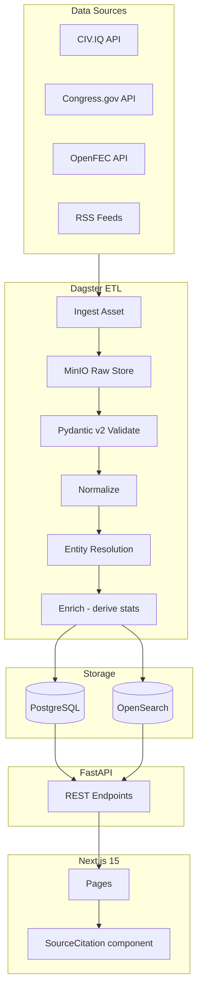

# Phase 1 — Federal MVP Detailed Plan

## Scope Reminder

Federal US only. 535 members of current Congress (119th). No AI, no maps, no state/local data, no user accounts.

**Milestone:** Any user can search a US senator or representative and see their bio, full voting record, FEC finance summary, and recent news — with a source citation on every displayed fact.

---

## Directory Structure

```
TransparentPolitics/
├── backend/
│   ├── app/
│   │   ├── api/v1/           # FastAPI routers
│   │   │   ├── politicians.py
│   │   │   ├── votes.py
│   │   │   ├── finance.py
│   │   │   ├── news.py
│   │   │   └── search.py
│   │   ├── core/
│   │   │   └── config.py     # pydantic-settings
│   │   ├── db/
│   │   │   ├── session.py    # engine + session factory
│   │   │   └── models/       # SQLAlchemy ORM models
│   │   ├── schemas/          # Pydantic response schemas
│   │   └── main.py
│   ├── alembic/versions/
│   ├── pyproject.toml
│   └── Dockerfile
│
├── etl/
│   ├── assets/
│   │   ├── congress/
│   │   │   ├── members.py    # Dagster asset
│   │   │   ├── legislation.py
│   │   │   └── votes.py
│   │   ├── fec/
│   │   │   ├── summaries.py
│   │   │   └── donations.py
│   │   └── news/
│   │       └── rss.py
│   ├── clients/
│   │   ├── civiq.py          # CIV.IQ HTTP client
│   │   ├── congress_gov.py   # Congress.gov direct client
│   │   ├── openfec.py
│   │   └── rss.py            # feedparser wrapper
│   ├── normalizers/          # Source → canonical schema mapping
│   ├── resolvers/
│   │   └── entity.py         # bioguide_id canonical lookup
│   ├── repository.py         # Dagster Definitions
│   └── pyproject.toml
│
├── frontend/
│   ├── app/
│   │   ├── page.tsx                         # Home / search landing
│   │   ├── search/page.tsx                  # Search results
│   │   └── politicians/[id]/
│   │       ├── page.tsx                     # Politician profile
│   │       ├── votes/page.tsx               # Full voting record
│   │       └── finance/page.tsx             # Campaign finance
│   ├── components/
│   │   ├── SourceCitation.tsx               # Source attribution — renders on every fact
│   │   ├── PoliticianCard.tsx
│   │   ├── VoteTable.tsx
│   │   ├── FinanceSummary.tsx
│   │   └── NewsFeed.tsx
│   ├── lib/
│   │   ├── api.ts                           # Typed fetch wrappers
│   │   └── types.ts
│   └── package.json
│
└── infra/
    ├── docker-compose.yml
    ├── docker-compose.prod.yml
    └── nginx/nginx.conf
```

---

## Data Flow



---

## Milestone 0: Dev Infrastructure (Week 1)

**Goal:** Every developer can run the full stack locally with one command.

**`infra/docker-compose.yml`** services:

| Service | Image | Port |
|---|---|---|
| `postgres` | `postgis/postgis:16-3.4` | 5432 |
| `redis` | `redis:7-alpine` | 6379 |
| `minio` | `minio/minio:latest` | 9000 / 9001 |
| `opensearch` | `opensearchproject/opensearch:2` | 9200 |
| `backend` | local Dockerfile | 8000 |
| `dagster` | local Dockerfile | 3000 (webserver) |
| `frontend` | local Dockerfile | 3001 |

**Backend scaffold** (`backend/app/main.py`):
```python
app = FastAPI(title="TransparentPolitics API", version="0.1.0")
app.include_router(politicians.router, prefix="/api/v1")
app.include_router(votes.router, prefix="/api/v1")
app.include_router(finance.router, prefix="/api/v1")
app.include_router(news.router, prefix="/api/v1")
app.include_router(search.router, prefix="/api/v1")
```

**Dagster scaffold** (`etl/repository.py`):
```python
defs = Definitions(assets=[], schedules=[], sensors=[])
```

**Frontend scaffold**: `npx create-next-app@latest frontend --typescript --tailwind --app`; install `shadcn/ui`, `@tanstack/react-query`.

**Alembic init**: `alembic init alembic` inside `backend/`; configure `env.py` to read `DATABASE_URL` from environment.

**`.env.example`** documenting all required vars:
```
DATABASE_URL=postgresql+asyncpg://tp:tp@localhost:5432/transparentpolitics
REDIS_URL=redis://localhost:6379
MINIO_ENDPOINT=localhost:9000
MINIO_ACCESS_KEY=
MINIO_SECRET_KEY=
OPENSEARCH_URL=http://localhost:9200
CONGRESS_GOV_API_KEY=
OPENFEC_API_KEY=
```

**CI** (`.github/workflows/ci.yml`): ruff lint + mypy + pytest on push; ESLint + tsc on push.

**Deliverable:** `docker compose up` starts all services; `GET /api/v1/health` returns 200; Dagster UI loads at `:3000`; Next.js home page loads at `:3001`.

---

## Milestone 1: Congress Members Pipeline (Weeks 2–3)

**Goal:** All 535 current members of Congress ingested with bios, office history, and committee memberships. Profile API endpoint live.

### Database migration (`alembic/versions/001_phase1_schema.py`)

Core tables created in a single migration:

```sql
-- Reference tables
parties (id, name, short_name, color_hex)
jurisdictions (id, name, type, parent_id, fips_code)
offices (id, title, level, chamber, jurisdiction_id)
data_sources (id, name, url, type, license, attribution_text, bias_rating)

-- Person tables
persons (id UUID PK, canonical_name, display_name, birth_date,
         bioguide_id UNIQUE, fec_candidate_id, wikidata_qid,
         created_at, updated_at)
person_external_ids (person_id, source_name, external_id)
officeholders (person_id, office_id, party_id, start_date,
               end_date, is_current, source_id)

-- Legislative
legislation (id, bill_number, title, session, introduced_date,
             status, subject_areas[], primary_sponsor_id, source_id,
             source_record_id, full_text_url)
roll_call_votes (id, legislation_id, vote_date, chamber, question,
                 result, yea_count, nay_count, abstain_count,
                 not_voting_count, source_url, source_id)
person_votes (person_id, vote_id, position, officeholder_id)

-- Finance
finance_summaries (person_id, cycle_year, total_raised, total_spent,
                   cash_on_hand, individual_contributions,
                   pac_contributions, source_filing_id, source_id)
donations (id, person_id, donor_name, donor_entity_type, donor_state,
           donor_employer, amount, date, committee_id,
           industry_code, transaction_type, source_id)

-- News
news_articles (id, title, url UNIQUE, canonical_url, published_at,
               source_name, source_domain, author, full_text_hash,
               summary, summary_model, summary_prompt_version,
               topics[], is_ai_inferred, source_id)
article_entity_links (article_id, entity_type, entity_id,
                      mention_count, source_id)

-- AI audit (empty in Phase 1, schema exists for Phase 3)
ai_inference_log (id, inference_type, model_name, model_version,
                  prompt_template_id, prompt_git_hash,
                  temperature, seed, top_p, max_tokens,
                  input_hash, output_text, output_hash,
                  confidence, created_at, reviewed_by,
                  review_status, review_notes)

-- ETL housekeeping
ingest_errors (id, source, endpoint, raw_payload, error_message, created_at)
data_conflicts (id, table_name, record_id, field, source_a, value_a,
                source_b, value_b, resolved_value, flagged_at)
```

Seed `data_sources` rows (CIV.IQ, Congress.gov, OpenFEC, BioGuide) and `parties` rows in the migration.

### API clients

**`etl/clients/civiq.py`**: typed `httpx.AsyncClient` wrapper around CIV.IQ `/api/v1/representatives` and related endpoints. Returns Pydantic models. Respects 60 req/min limit with exponential backoff.

**`etl/clients/congress_gov.py`**: typed `httpx.AsyncClient` wrapper for `api.congress.gov/v3/member`. Used as fallback and cross-validation against CIV.IQ. Respects 5,000 req/hr.

### Dagster assets (`etl/assets/congress/members.py`)

```python
@asset(group_name="congress", compute_kind="python")
def raw_congress_members(context) -> Output:
    """Fetch all 535 members from CIV.IQ; store raw JSON in MinIO."""

@asset(deps=[raw_congress_members], group_name="congress")
def normalized_congress_members(raw_congress_members) -> Output:
    """Validate with Pydantic v2 CongressMember schema; normalize fields."""

@asset(deps=[normalized_congress_members], group_name="congress")
def congress_members(normalized_congress_members, db: Session) -> Output:
    """Resolve entities via bioguide_id; upsert persons + officeholders."""
```

Entity resolution in `etl/resolvers/entity.py`:
- Exact match on `bioguide_id` → update existing person
- If no bioguide_id (edge cases): score on (normalized_name + state + chamber + party); auto-merge only if score ≥ 0.95; else queue to `ingest_errors` with reason
- Log every merge decision with source provenance

### API endpoints (`backend/app/api/v1/politicians.py`)

```
GET /api/v1/politicians
    ?chamber=house|senate
    ?state=CA
    ?party=Democrat|Republican|Independent
    ?page=1&per_page=50
    → PoliticianListResponse

GET /api/v1/politicians/{bioguide_id}
    → PoliticianDetailResponse
    {
      id, bioguide_id, canonical_name, display_name, birth_date,
      party, state, district, chamber, current_office,
      office_history[],
      source: { name, url, fetched_at }   ← SourceCitation on every response
    }
```

Every response schema includes a top-level `sources: list[SourceRef]` field — `{ name, url, fetched_at }` — so the frontend can render `SourceCitation` on every page.

**Deliverable:** `GET /api/v1/politicians/S000148` returns Chuck Schumer's full profile with source attribution.

---

## Milestone 2: Voting Records Pipeline (Weeks 4–5)

**Goal:** Full roll-call vote history for the 119th Congress (and optionally 116th–118th). Per-member stats derived deterministically.

### Dagster assets

**`etl/assets/congress/legislation.py`**:
- Fetch bills from Congress.gov API (paginated, all types: HR, S, HJRES, SJRES, etc.)
- Normalize to `legislation` table
- Schedule: hourly

**`etl/assets/congress/votes.py`**:
- Fetch roll-call votes from Congress.gov + House Clerk XML + Senate.gov XML (via CIV.IQ `/api/v1/votes`)
- Fan out: for each vote, fetch individual member positions
- Normalize to `roll_call_votes` + `person_votes`
- Schedule: hourly

**Enrich step (deterministic SQL, no AI):**

After each votes ingest run, recompute and store these derived stats per person in a `person_vote_stats` materialized view or table:
```sql
party_line_pct    -- votes matching party majority / total votes
missed_votes_pct  -- not_voting / total votes
bipartisan_pct    -- votes with opposing party majority / total
total_votes_cast
```

### API endpoints (`backend/app/api/v1/votes.py`)

```
GET /api/v1/politicians/{bioguide_id}/votes
    ?page=1&per_page=50
    ?chamber=house|senate
    ?position=yea|nay|abstain|not_voting
    ?date_from=2023-01-01&date_to=2026-01-01
    → VoteHistoryResponse { votes[], stats, sources[] }

GET /api/v1/votes/{vote_id}
    → VoteDetailResponse {
        vote metadata,
        result,
        yea_members[], nay_members[], abstain_members[], not_voting_members[],
        legislation: { bill_number, title, full_text_url },
        source: { url }
      }

GET /api/v1/politicians/{bioguide_id}/votes/stats
    → { party_line_pct, missed_votes_pct, bipartisan_pct, total_votes_cast,
        sources[] }
```

**Deliverable:** `GET /api/v1/politicians/S000148/votes/stats` returns party-line and missed-vote percentages with link to official Senate.gov roll-call source.

---

## Milestone 3: Campaign Finance Pipeline (Weeks 6–7)

**Goal:** FEC per-cycle finance totals and top individual donations for all Congress members.

### OpenFEC client (`etl/clients/openfec.py`)

Typed `httpx.AsyncClient` respecting 1,000 req/hr standard limit. Key endpoints:
- `/candidate/` — link FEC candidate_id to bioguide_id via name + state + office matching
- `/candidate/{id}/totals/` — per-cycle finance summaries
- `/schedules/schedule_a/` — individual contributions (paginated, sorted by amount)

### Dagster assets

**`etl/assets/fec/summaries.py`**:
- For each person with a `fec_candidate_id`, fetch all cycle totals
- Normalize to `finance_summaries`
- Schedule: daily

**`etl/assets/fec/donations.py`**:
- Fetch top-N individual contributions per candidate per cycle (start with N=500 for MVP)
- Normalize to `donations` table
- Industry classification: use `@civiq/entity-resolution` logic ported to Python or call CIV.IQ `/api/v1/finance/campaign` which already includes industry_code
- Schedule: daily

FEC candidate_id resolution: match on (normalized_name + state + office type + election_year). Flag ambiguous matches for human review before writing.

### API endpoints (`backend/app/api/v1/finance.py`)

```
GET /api/v1/politicians/{bioguide_id}/finance
    ?cycle=2024
    → FinanceSummaryResponse {
        cycle_year,
        total_raised, total_spent, cash_on_hand,
        individual_contributions, pac_contributions,
        top_industries[{ industry, total_amount, pct }],
        sources[]
      }

GET /api/v1/politicians/{bioguide_id}/finance/donations
    ?cycle=2024&page=1&per_page=50
    → DonationListResponse {
        donations[{ donor_name, amount, date, employer, state }],
        sources[]
      }
```

**Deliverable:** Finance summary page shows total raised, PAC vs. individual split, top-5 industries with a "Source: FEC.gov filing #XYZ" citation under every number.

---

## Milestone 4: News Aggregation + Search (Weeks 8–9)

**Goal:** Recent political news normalized by politician/topic. Full-text search across politicians, bills, and articles.

### RSS sources (configured in `data_sources` seed)

Select 8–10 outlets spanning the bias spectrum (AP, Reuters, NPR Politics, The Hill, Politico, PBS NewsHour, WSJ Politics, Fox News Politics, The Guardian US). Store `bias_rating` for each in `data_sources`. No full text stored — only `title`, `url`, `published_at`, `source_name`. `summary` and `topics[]` are NULL in Phase 1.

### Dagster sensor (`etl/assets/news/rss.py`)

```python
@sensor(minimum_interval_seconds=900)  # 15 minutes
def rss_news_sensor(context):
    """Poll all active RSS sources. Deduplicate by url hash. Yield RunRequest."""
```

For each feed item:
1. Compute `full_text_hash = sha256(title + url)`
2. Skip if URL already exists in `news_articles`
3. Normalize to `news_articles` (no AI — summary=NULL, topics=[])
4. Attempt naive entity linking: string-match article title against `persons.canonical_name`; write `article_entity_links` with `extraction_model='string_match_v1'`

### OpenSearch index configuration

**`opensearch/index_configs/politicians.json`**: `name` field with `edge_ngram` analyzer (min_gram=2, max_gram=20) for autocomplete; `state`, `party`, `chamber` as keyword fields for faceting.

**`opensearch/index_configs/legislation.json`**: `title`, `subject_areas` with `english` analyzer; `bill_number` as keyword.

**`opensearch/index_configs/articles.json`**: `title` with `english` analyzer; `source_name` as keyword; `published_at` for date range and recency boosting.

**Sync asset** (`etl/assets/opensearch_sync.py`): runs after each ingest asset completes; upserts changed records to the relevant index using `opensearchpy` bulk API.

### API endpoints

```
GET /api/v1/news
    ?politician_id={bioguide_id}
    ?page=1&per_page=20
    → NewsListResponse { articles[{ title, url, source_name, source_bias_rating,
                                    published_at, persons_mentioned[] }] }

GET /api/v1/search
    ?q=pelosi
    ?type=all|politician|legislation|article
    ?state=CA&party=Democrat&chamber=house
    ?date_from=2024-01-01
    ?page=1&per_page=20
    → SearchResponse { results[{ type, id, title, snippet, score }],
                       total, facets }
```

Autocomplete endpoint for the frontend search box:
```
GET /api/v1/search/autocomplete?q=pelo
    → [{ type: "politician", id: "P000197", label: "Nancy Pelosi (D-CA)" }]
```

**Deliverable:** Search bar returns politician autocomplete in under 200ms. Article feed shows bias rating label next to each source name.

---

## Milestone 5: Frontend + Deployment (Weeks 10–12)

**Goal:** Working web UI deployed to a cloud server with Cloudflare in front.

### Key pages

**`app/page.tsx` — Home / Search landing**
- Search bar with autocomplete (calls `/api/v1/search/autocomplete`)
- Minimal hero: platform tagline, link to "how data is sourced" page
- No editorial content

**`app/search/page.tsx` — Search results**
- TanStack Query fetches `/api/v1/search`
- Result cards for politicians, bills, articles
- Left-sidebar facet filters (party, state, chamber, date range)

**`app/politicians/[id]/page.tsx` — Politician profile**
- Bio, current office, party, term dates — each with `<SourceCitation>`
- Tabbed navigation: Overview / Votes / Finance / News
- Overview tab: vote stats (party-line %, missed %), top-5 finance industries, 5 recent news items
- All sourced from Server Components (SSR) for fast first paint

**`app/politicians/[id]/votes/page.tsx` — Voting record**
- Filterable, paginated `VoteTable` component
- Columns: Date / Bill / Question / Position / Result
- Position chip color-coded (yea=green, nay=red, abstain=gray, not_voting=muted)
- "Source: House Clerk / Senate.gov" citation row at the bottom of each page

**`app/politicians/[id]/finance/page.tsx` — Campaign finance**
- Cycle selector (dropdown)
- Total raised / spent / cash-on-hand with FEC citation
- Industry breakdown (bar chart using Recharts)
- Individual donations table, paginated
- "Source: FEC filing #XYZ — OpenFEC API" on every number

### `SourceCitation` component

Built in Week 10, used everywhere from day one. Takes a `sources: SourceRef[]` prop and renders an expandable "Sources" disclosure at the bottom of every data section — not a footnote superscript, a visible inline label. This enforces the platform's core principle at the component level.

```typescript
interface SourceRef {
  name: string;
  url: string;
  fetched_at: string;
  license?: string;
}
```

### Deployment

**`infra/docker-compose.prod.yml`**: production overrides — remove dev ports, add health checks, set `restart: always`, reference secrets from environment.

**Nginx** (`infra/nginx/nginx.conf`): reverse proxy to backend (:8000) and frontend (:3001); HTTPS termination via Certbot; gzip compression; static asset caching headers.

**Cloudflare**: DNS-proxied A record; cache rules for static assets (`/_next/static/`); rate limiting rules mirroring backend limits; DDoS protection on by default.

**Single cloud server minimum spec**: 4 vCPU / 8 GB RAM / 100 GB SSD. All services run on the same host in Phase 1 (separate later in Phase 3 when GPU inference is added).

**Deliverable:** `https://transparentpolitics.com/politicians/S000148` loads in under 2 seconds with full profile, voting record, finance summary, and news feed — every data point citing its source.

---

## API Summary

| Endpoint | M | Notes |
|---|---|---|
| `GET /api/v1/health` | M0 | Liveness check |
| `GET /api/v1/politicians` | M1 | List with filters |
| `GET /api/v1/politicians/{id}` | M1 | Profile + source citations |
| `GET /api/v1/politicians/{id}/votes` | M2 | Paginated vote history |
| `GET /api/v1/politicians/{id}/votes/stats` | M2 | Party-line %, missed % |
| `GET /api/v1/votes/{id}` | M2 | Full vote detail + member breakdown |
| `GET /api/v1/politicians/{id}/finance` | M3 | Per-cycle totals + industries |
| `GET /api/v1/politicians/{id}/finance/donations` | M3 | Paginated donor list |
| `GET /api/v1/news` | M4 | Feed with politician/topic filter |
| `GET /api/v1/search` | M4 | Multi-index search + facets |
| `GET /api/v1/search/autocomplete` | M4 | Typeahead for search bar |

All responses include `sources: SourceRef[]`. All list endpoints paginate with `{ items, total, page, per_page, has_next }`.

---

## Key Technical Decisions for Phase 1

- **CIV.IQ as primary for members data** (fast start, hourly refresh) with direct Congress.gov as fallback and cross-validation source. Both clients are implemented from M1 — never depend on only one.
- **feedparser for RSS** — no paid news API subscription needed for MVP. Upgrade to a paid API (NewsAPI, etc.) in Phase 2 when volume demands it.
- **119th Congress as default scope**; the ETL accepts a `congress_number` parameter to back-fill 116th–118th without code changes.
- **OpenSearch sync is async** — runs as a separate Dagster asset after each ingest run completes. No CDC or real-time sync in Phase 1.
- **No authentication** — all Phase 1 endpoints are public read-only. Rate limiting is IP-based via Redis from day one.
- **`SourceCitation` from day one** — built in M0 skeleton, used on every page. Not retrofitted later.
- **`ai_inference_log` table in M1 migration** — empty in Phase 1, but the schema is there so Phase 3 writes into a pre-existing structure with no breaking migrations.
