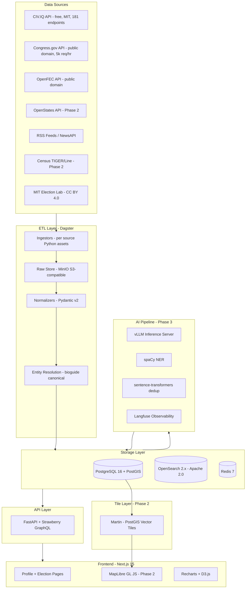
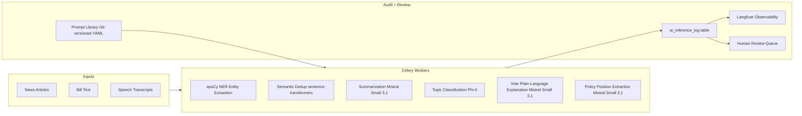

# Political Intelligence Platform — Technical Product Plan

## MVP Definition

Scope Phase 1 to **federal US government only** (current Congress + recent history). This is achievable in 8–12 weeks and produces immediate value before tackling state/local data complexity.

**MVP includes:**

- Politician profiles: 535 members of Congress — bio, office history, party affiliation
- Voting records: roll-call vote breakdown, party-line stats, missed votes
- Campaign finance: FEC totals per cycle, top industry categories, PAC vs. individual breakdown
- News aggregation: RSS/NewsAPI from 8–10 outlets, normalized by politician and topic
- Basic text search: politician name, bill number, topic keyword
- Simple web UI: search, profile pages, vote detail, finance summary

**MVP excludes (deferred):** interactive maps, state/local politicians, polling aggregation, AI features, user accounts, policy positions.

---

## System Architecture




---

## Tech Stack

**Backend / Data**

- Language: Python 3.12+
- API framework: FastAPI with Strawberry GraphQL (complex relational queries)
- ORM: SQLAlchemy 2.0 + Alembic migrations
- ETL orchestration: Dagster (modern Python-first, better DX than Airflow for this use case)
- Data validation: Pydantic v2 for all inbound data
- Background tasks: Celery + Redis for near-real-time processing

**Databases**

- Primary: PostgreSQL 16 + PostGIS 3.x — relational + geospatial
- Search: OpenSearch 2.x (Apache 2.0; avoids Elasticsearch SSPL licensing concerns)
- Cache: Redis 7.x
- Object storage: MinIO (S3-compatible, self-hosted) — raw API responses, AI artifacts, 2-year retention

**AI / LLM (all open-source, GPU server required from Phase 3)**

- Inference server: vLLM (Apache 2.0) for production; Ollama for local development
- Summarization + extraction: **Mistral Small 3.1 24B** (Apache 2.0) — best balance of quality and throughput under a permissive license
- Fallback / auditability option: **OLMo 3** (Apache 2.0, Ai2) — fully open training stack including training data; strongest reproducibility story
- Classification: **Phi-4-mini Instruct** (MIT, Microsoft) — strong classification and summarization on modest hardware; verify exact checkpoint license on Hugging Face before use
- NER: spaCy `en_core_web_trf` (MIT) + political-entity fine-tune — fast, deterministic, CPU-capable; prefer dedicated NER models over LLM for token-level span extraction
- Embeddings / semantic dedup: `all-MiniLM-L6-v2` or `bge-small-en-v1.5` sentence-transformers (Apache 2.0 — verify per model card)
- LLM observability: Langfuse (MIT core, self-hosted)
- Prompt evaluation: Promptfoo (Apache 2.0)
- **License note:** Meta Llama models use the Meta Llama Community License (custom, not Apache/MIT). Do not use Llama if the hard requirement is OSI-approved Apache 2.0 or MIT licensing. Mistral and OLMo 3 are the correct defaults under that constraint.

**Frontend**

- Framework: Next.js 15 App Router + TypeScript
- Maps: MapLibre GL JS 4.x (BSD-3-Clause) — open-source fork of Mapbox
- Vector tiles: Martin tile server (Apache 2.0) + PMTiles for static boundary files
- Charts: Recharts + D3.js
- UI: Tailwind CSS + shadcn/ui
- Data fetching: TanStack Query v5

**Infrastructure**

- Containers: Docker + Docker Compose (dev), Kubernetes (production)
- CDN / DDoS: Cloudflare (free tier)
- Secrets: HashiCorp Vault or environment-based

---

## Primary Data Sources

**Free / Public Domain — use these first**

- **CIV.IQ** (civdotiq.org) — MIT, no auth, 181 endpoints, 60 req/min. Aggregates Congress.gov, FEC, OpenStates, Census, Wikidata, Senate LDA, MIT Election Lab into a single API. Bulk downloads (CSV/JSON) updated hourly. Ideal MVP fast-path for federal data. Treat as convenience layer; always maintain direct API fallback clients.
- **Congress.gov API** (api.congress.gov) — Public domain, free key via api.data.gov, 5,000 req/hr. Members, bills, votes, committees, hearings, 116th–119th Congress.
- **OpenFEC API** (api.open.fec.gov) — Public domain, free key (~1,000 req/hr standard; contact FEC for enhanced ~7,200/hr). Campaign finance, candidates, committees, individual contributions.
- **OpenStates API** (openstates.org) — Free key required, tiered limits. All 50 states: legislators, bills, committees, votes. (Phase 2)
- **Census Bureau TIGER/Line** (census.gov) — Public domain. Congressional districts, state legislative districts, counties, cities. Pin a single vintage (2024 or 2025) per release and document it. (Phase 2)
- **MIT Election Data and Science Lab** — CC BY 4.0. Historical election results 1976–2024, precinct-aggregated. Available as Dataverse downloads and R package.
- **unitedstates/congress** GitHub repo — Public domain. The community-maintained canonical dataset behind GovTrack; voting records, legislator data, cross-source IDs. Note: GovTrack's own live API was discontinued years ago; use this repo instead.
- **Wikidata SPARQL** (query.wikidata.org) — CC0. Biographical data, cross-source canonical QIDs. Requires User-Agent header; throttle carefully.
- **Senate LDA API** (lobbyingdisclosure.senate.gov) — Public. Lobbying disclosures and registrant filings.
- **BioGuide** (bioguide.congress.gov) — Public domain. Canonical congressional biographical database; bioguide IDs used as canonical federal legislator key.

**Supplemental (free tier or attribution-required)**

- **LegiScan** (legiscan.com) — Free public API tier (~30,000 queries/month); paid tiers available. State and federal legislative tracking; useful supplement to OpenStates.
- **GDELT Project** — CC0 bulk daily exports and BigQuery public dataset (1 TB/month free query tier). Global news entity/event extraction.
- **FollowTheMoney.org** — State campaign finance; verify current API availability and license before use.
- **Ballotpedia** — Paid commercial data licensing; investigate data sharing program for nonprofits/researchers.
- **VoteSmart** (votesmart.org) — API key required; nonpartisan civic data including candidate ratings, bios, ballot measures. Review commercial terms before production use.
- **MapLight** (maplight.org) — Campaign finance aggregates and contribution search; free noncommercial / paid commercial license.

**Deprecated or discontinued sources — do not use**

- ProPublica Congress API — **deprecated and unavailable** as of 2025; replaced by direct Congress.gov API.
- OpenSecrets API — **discontinued April 15, 2025**; use OpenFEC directly for campaign finance; MapLight for industry aggregations.
- Google Civic Information API (representatives endpoints) — **sunset** (~2025); the Elections and Divisions endpoints continue but representative lookups were removed. CIV.IQ's district lookup endpoints (`/api/v1/civic/district`) cover the core representative-by-address use case.

**Entity resolution strategy**

This is the hardest technical problem — the same politician appears in FEC (candidate_id), Congress.gov (bioguide_id), OpenStates (openstates_id), Wikidata (QID), and news (name variants).

Strategy:

- Use `bioguide_id` as canonical ID for all federal legislators
- Use Wikidata QID as global cross-reference
- Maintain `person_external_ids` table mapping every source ID to one internal UUID
- Use `@civiq/entity-resolution` (MIT npm package) for FEC contributor deduplication
- For probabilistic matching: score on (normalized_name + state + party + term_date_overlap); require score > 0.95 for auto-merge; queue lower scores for human review
- Never silently merge uncertain records; show "data matched from X sources" on every profile

---

## Core Data Model

Key PostgreSQL tables:

**persons** — canonical politician record

```
id (UUID), canonical_name, display_name, birth_date, death_date
bioguide_id, fec_candidate_id, openstates_id, wikidata_qid
created_at, updated_at
```

**person_external_ids** — all source cross-references

```
person_id, source_name, external_id
```

**officeholders** — person-to-office assignments with dates

```
person_id, office_id, party_id, start_date, end_date, is_current
jurisdiction_id, district_id, data_source_id
```

**districts** — versioned electoral districts with geometry

```
id, type (congressional/state_upper/state_lower), jurisdiction_id, number
effective_start_cycle, effective_end_cycle
geom (PostGIS MultiPolygon), geom_simplified (for tile serving)
```

**roll_call_votes** + **person_votes** — legislative voting record

```
roll_call_votes: vote_date, chamber, question, result, yea/nay/abstain counts, source_url
person_votes: person_id, vote_id, position (yea/nay/abstain/not_voting/present), officeholder_id
```

**legislation** — bills and resolutions

```
id, bill_number, title, session, introduced_date, status, subject_areas[]
primary_sponsor_id, source, source_id, full_text_url
```

**elections** + **election_results** — election events and outcomes

```
elections: election_date, type (primary/general/runoff/special), office_id, cycle_year
election_results: election_id, person_id, party_id, votes, vote_pct, is_winner
```

**finance_summaries** — aggregated FEC filing totals per person per cycle

```
person_id, cycle_year, total_raised, total_spent, cash_on_hand
individual_contributions, pac_contributions, source_filing_id
```

**donations** — individual FEC contributions

```
person_id (recipient), donor_name, donor_entity_type, donor_state
donor_employer, amount, date, committee_id, industry_code, transaction_type
```

**polls** + **poll_results** — polling data

```
polls: pollster_name, pollster_grade, methodology, sample_size, poll_type, election_id, source_url
poll_results: poll_id, candidate_label, person_id, percentage, subsample_label
```

**news_articles** — ingested articles (never store full text)

```
id, title, url (unique), published_at, source_name, source_domain
full_text_hash, summary (AI-generated), summary_model, summary_prompt_version
topics[], sentiment_label, is_ai_inferred (bool)
```

**policy_positions** — stated or inferred policy stances

```
person_id, topic_id, position_text
position_type: stated | voted | inferred (AI)
source_type, source_url, source_date
confidence_score (0.0–1.0), extraction_model (nullable)
is_human_verified, notes
```

**ai_inference_log** — complete AI provenance audit trail

```
inference_type, model_name, model_version
prompt_template_id, prompt_git_hash, temperature, seed, top_p, max_tokens
input_hash, output_text, output_hash, confidence
created_at, reviewed_by, review_status, review_notes
```

**data_sources** — source registry

```
id, name, url, type (api/bulk/rss), license, attribution_text
bias_rating, credibility_rating, last_fetched_at, fetch_frequency
```

---

## ETL Pipeline Design

**Orchestration**: Dagster with Python-based asset definitions. Use assets (not jobs) for incremental, ide5 mpotent processing.

**Five-stage pipeline per source:**

1. **Ingest** — Pull from upstream API; store raw JSON response in MinIO with `{source}/{date}/{endpoint}.json` path. Never overwrite raw data.
2. **Validate** — Pydantic v2 schemas validate structure; failed records go to `ingest_errors` table with full raw payload.
3. **Normalize** — Map source field names to canonical schema; standardize dates (ISO 8601), name casing, party codes.
4. **Resolve** — Entity resolution against canonical `persons` table. Exact match on canonical IDs first; probabilistic fallback; unresolved records queued for review.
5. **Enrich + Index** — Compute derived fields (party-line %, finance aggregations); write to PostgreSQL; sync changed records to OpenSearch.

**Conflict resolution rule**: Maintain `source_priority` per data type. When sources disagree, store all versions with confidence weights; display highest-priority source; show "sources disagree" indicator in UI. Never silently discard a value.

**Data freshness targets:**

- Votes / bills: 1-hour lag (poll Congress.gov hourly)
- News articles: 15-minute lag (RSS polling + webhook where available)
- Campaign finance: daily (FEC bulk downloads)
- Politician profiles: 24 hours
- Geographic boundaries: cycle-based (after redistricting)

---

## AI / LLM Pipeline

All AI features are **additive and clearly labeled**. Not in MVP; invoked only after Phase 1 is stable.




**Task-to-model mapping:**


| Task                 | Model                                             | License    | Notes                                                                   |
| -------------------- | ------------------------------------------------- | ---------- | ----------------------------------------------------------------------- |
| NER                  | spaCy `en_core_web_trf`                           | MIT        | Fast, CPU-capable, deterministic                                        |
| Semantic dedup       | `all-MiniLM-L6-v2`                                | Apache 2.0 | Cosine similarity threshold 0.92                                        |
| Summarization        | Mistral Small 3.1 24B                             | Apache 2.0 | Temperature 0.1, seed 42                                                |
| Topic classification | Phi-4-mini Instruct                               | MIT        | Temperature 0.0 for determinism; verify HF model card license           |
| Vote explanation     | Mistral Small 3.1 24B                             | Apache 2.0 | Temperature 0.1, seed 42                                                |
| Policy extraction    | OLMo 3 Instruct (Apache 2.0) or Mistral Small 3.1 | Apache 2.0 | Temperature 0.0, human review required; OLMo preferred for auditability |


**Inference metadata stored for every job** (enables exact reproduction):

```yaml
model: mistral-small-3.1-24b-instruct
model_version: "2025-03-14"   # pinned tag, never "latest"
temperature: 0.1
seed: 42
top_p: 0.9
max_tokens: 512
prompt_template_id: news-summary-v1.2
prompt_git_hash: a3f7b22       # SHA of prompt YAML in repo
input_hash: sha256:...         # SHA-256 of input text
```

**Prompt versioning**: All prompts stored in `prompts/` directory as YAML files under version control. Each prompt has `name`, `version`, `task_type`, `model_target`, `system_message`, `user_template`, `few_shot_examples`, `expected_output_schema`. Prompts are referenced by ID + git SHA in all inference logs.

**Summarization prompt design** (example structure):

```
System: You are a neutral political journalist. Summarize only what the article states.
Do not add external knowledge. Use plain, neutral language. No political opinions.

Required JSON output:
{
  "summary": "2-3 sentence neutral summary",
  "key_claims": [{"claim": "...", "quote_snippet": "..."}],
  "persons_mentioned": ["Full Name"],
  "topics": ["healthcare" | "economy" | "immigration" | ...],
  "confidence": 0.0-1.0
}
```

**Policy position extraction rules** (strictest requirements):

- `position_type` must be `stated` (direct quote), `voted` (voting record), or `inferred`
- If `inferred`, confidence must be ≤ 0.65 and human review is mandatory before display
- Prompt must include explicit rubric: "Cite the specific text supporting each position"
- Never present `inferred` positions in search results or headlines

**Evaluation pipeline** (run on every prompt version change):

- Summarization: ROUGE-1/2/L + NLI-based factual consistency check against source
- NER: Precision/recall/F1 on manually labeled 500-article political entity test set
- Classification: Balanced F1 + partisan balance check (Democrat vs Republican test subjects get statistically equivalent quality)
- Policy extraction: Human evaluation of 50 sampled outputs per prompt version
- All eval results stored in `prompt_eval_results` table

---

## Geospatial Strategy

**Data pipeline:**

1. Download Census TIGER/Line shapefiles (annual, post-redistricting cycle) — congressional districts, state legislative upper/lower, counties, incorporated places
2. Convert to GeoJSON with GDAL/ogr2ogr
3. Generate simplified geometries with Tippecanoe for tile serving
4. Import into PostGIS: full-precision for point-in-polygon queries, simplified for tile serving
5. Store with `effective_start_cycle` / `effective_end_cycle` — never overwrite historical boundaries

**Tile serving:**

- Martin tile server (Rust, Apache 2.0) — serves vector tiles from PostGIS on the fly
- PMTiles static archives for stable boundary layers — host on CDN, no server needed
- MapLibre GL JS on frontend — BSD-3-Clause, open source Mapbox fork

**Frontend map capabilities:**

- Toggle layers: states, congressional districts, state legislative districts, counties
- Click any region: see politicians, election history, campaign finance, polling summary
- Address lookup: Census Geocoder API → congressional district → profile
- Choropleth views: vote margins, fundraising totals, polling by district
- govtrack/congress-maps GitHub repo as reference implementation for district processing pipeline (Census → GeoJSON → PMTiles)

---

## Search Strategy

OpenSearch 2.x (Apache 2.0) with separate indexes:


| Index         | Key Fields                                        | Features                    |
| ------------- | ------------------------------------------------- | --------------------------- |
| `politicians` | name, bio, state, party, office                   | edge n-gram autocomplete    |
| `legislation` | title, bill_number, sponsor, subject_areas        | english analyzer + synonyms |
| `articles`    | title, summary, source, topics, persons_mentioned | recency boost               |
| `elections`   | name, cycle_year, state, district                 | standard                    |
| `votes`       | question, vote_date, legislation_title            | date range filter           |


- Faceted filters: party, state, office level, time period, topic, bias_rating
- Multi-index blend for main search bar
- Phase 3: store sentence-transformer embeddings as `dense_vector`; add k-NN semantic search
- API: `GET /api/v1/search?q={}&type={all|politician|bill|article}&filters={json}`

---

## Handling Conflicting, Incomplete, and Biased Data

**Conflicting data:** Source-priority ranking per data type (official API > established civic org > secondary/scraped). Store all versions with provenance in `data_conflicts` table. Display highest-priority value with a "sources disagree — see details" indicator. Never silently discard a value.

**Incomplete data:** Nullable columns only; never impute. Show data completeness indicators ("voting record: complete | policy positions: partial"). Explicitly distinguish "no data available" from "abstained" or "not applicable."

**Media bias:** Maintain `bias_rating` per news source from AllSides or Media Bias/Fact Check (attributed clearly). Surface the rating as a label on articles. Do not filter or de-rank articles by bias — show all, let users filter. Apply equal coverage standards to all parties.

**AI bias auditing:** Quarterly red-team runs where identical prompts are tested with Democrat and Republican subjects; results logged in `ai_bias_audit` table; human review if disparity exceeds 10% in any quality metric.

---

## Citation, Provenance, and Auditability

Every displayed fact must be traceable:

- **Raw facts** (vote positions, finance figures): link to official government record with direct URL
- **Derived facts** (party-line %, fundraising totals): show formula and contributing source records
- **AI summaries**: show source article URL, model name, model version, prompt version + git hash, confidence score; expandable "how this was generated" panel
- **AI-inferred policy positions**: show extracted source text excerpt, full model metadata, confidence score; displayed in a visually distinct "AI-inferred, not verified" block
- **Stated positions**: link to original source (transcript URL, campaign page, debate clip)

Data lineage: every row has `source_id` (FK to `data_sources`) and `source_record_id` (upstream primary key). Raw API responses retained in MinIO for 2 years. The `ai_inference_log` table stores all AI processing with full reproducibility metadata. Corrections workflow: any subject or user can flag a data error; reviewed within 48 hours.

---

## Legal, Licensing, and Ethical Considerations

**Copyright / data use:**

- Never store or display full article text. Store only title, URL, publication date, and AI-generated 2–3 sentence summary. Always link back to original.
- Review terms of service for every RSS/API source before ingesting. Reject sources with "no scraping" clauses unless explicit permission obtained.
- FEC, Congress.gov, Census TIGER/Line: public domain — no restrictions.
- OpenStates, MIT Election Lab: open licenses; follow attribution requirements.
- Wikidata: CC0 — no restrictions.

**Defamation risk:**

- All claims must cite an official government source or a named publication with a direct URL.
- Voting records: report exactly what official roll-call records show.
- Policy positions: strictly distinguish stated (direct quote), voted (voting record), and inferred (AI, clearly labeled, human-reviewed before display).
- "Controversies" section: require two corroborating named sources; legal review before shipping.
- Maintain corrections workflow — accept and publicly acknowledge data corrections.

**Political neutrality:**

- Equal coverage depth and quality for all registered parties and candidates.
- Quarterly algorithmic balance audit — party-disaggregated quality metrics.
- No editorial endorsements, rankings, or platform-level ratings of politicians.
- Bias indicator on news sources is descriptive metadata, not editorial comment.

**AI content disclosure:**

- Every AI-generated text must display an "AI-generated" label before the content.
- AI-inferred claims must be visually distinct from sourced facts in all views.
- Never surface AI-inferred positions in search result snippets or page titles.
- Monitor and comply with any AI disclosure regulations as they emerge.

**Privacy:**

- FEC donor disclosure is legally required for contributions over $200 — displaying it is lawful.
- Do not display home addresses of donors or private individuals.
- GDPR/CCPA compliance for user accounts: minimal data, right to deletion, no covert tracking.

---

## Security

- **Auth:** JWT (short-lived + refresh token) with OAuth2 (GitHub/Google) for social login
- **RBAC:** anonymous (read-only, rate-limited) / registered / pro / admin
- **Rate limiting:** Redis-based sliding window per IP (anonymous) and per user (authenticated); strict limits on search and export
- **Input validation:** Pydantic v2 everywhere; no raw user input into queries or prompts
- **SQL injection:** SQLAlchemy ORM parameterized queries only
- **XSS:** React escaping + Content-Security-Policy headers
- **CSRF:** SameSite cookies + CSRF tokens on state-changing forms
- **DDoS:** Cloudflare CDN + DDoS mitigation
- **Secrets:** Never in source code; environment variables or Vault; rotate quarterly
- **Audit log:** All admin writes logged (user, timestamp, change diff)
- **Abuse:** Politician profiles can be used for harassment campaigns; establish abuse reporting workflow; never enable bulk export of personal contact information

---

## Monetization and User Types

**Target users:** Journalists, civic-minded citizens, campaign staff, opposition researchers, academic researchers, think tanks, advocacy groups, data journalists.

**Tier structure:**

- **Free:** Current politician profiles, 90-day news window, current voting records, basic FEC totals, map navigation, basic text search
- **Pro (~$19/month):** Full historical data, all search filters, CSV/JSON export, saved searches and email alerts, full campaign finance industry breakdown
- **Research (~$79/month):** Full REST/GraphQL API access, bulk data export, AI pipeline outputs with full provenance metadata
- **Enterprise (custom):** White-label, custom data integration, SLA, dedicated support

---

## Major Technical Risks

1. **Entity resolution false merges** silently misattribute votes or donations to the wrong person. Mitigation: conservative merge strategy with canonical IDs first; probabilistic matches go to human review queue; every profile shows "data matched from N sources."
2. **AI hallucination in political context** — inaccurate summaries or policy positions about real people. Mitigation: ground all outputs strictly in provided source text; temperature near 0 for factual tasks; confidence thresholds with human review gates; prominent AI labeling everywhere.
3. **Upstream API deprecation** — Several major civic data APIs have already shut down (ProPublica Congress API, OpenSecrets API, GovTrack live API, Google Civic representative endpoints). CIV.IQ or OpenStates could follow. Mitigation: build direct API clients for Congress.gov, OpenFEC, OpenStates, and Census from day one; treat CIV.IQ as a convenience layer only; retain raw API responses in MinIO for replay; monitor provider status pages quarterly.
4. **Redistricting breaks historical data** — district boundaries change post-Census. Mitigation: version all district geometries with `effective_start_cycle` / `effective_end_cycle`; never overwrite historical shapes.
5. **LLM inference cost at scale** — millions of articles overwhelm GPU budget. Mitigation: process asynchronously in low-priority queues; cache embeddings; use spaCy NER before LLM; horizontal scale with vLLM; start with smaller models and upgrade selectively.
6. **Political bias in AI outputs** — LLMs may skew coverage quality or tone by party. Mitigation: quarterly red-team with equal Democrat/Republican test subjects; use temperature 0 for factual tasks; human review for high-visibility outputs; public bias audit reports.
7. **Legal challenge from inaccurate AI claims** — a politician challenges an AI-inferred position presented as fact. Mitigation: strict visual distinction of AI vs sourced data; corrections workflow; legal counsel review before shipping policy inference; never use "AI-inferred" in page titles or meta descriptions.
8. **Single aggregator dependency** — MVP relies heavily on CIV.IQ. Mitigation: maintain direct API fallback clients for Congress.gov, FEC, and OpenStates from day one; validate CIV.IQ data against upstream periodically.

---

## Phased Development Roadmap

### Phase 1: Federal MVP (Weeks 1–12)

- Project scaffold: FastAPI, PostgreSQL + PostGIS, Redis, MinIO, Docker Compose, Next.js 15
- Dagster pipelines: ingest Congress members, voting records, FEC finance, RSS news via CIV.IQ + direct Congress.gov/FEC APIs
- Core schema: persons, person_external_ids, officeholders, legislation, roll_call_votes, person_votes, finance_summaries, news_articles, data_sources
- Entity resolution for federal legislators (bioguide_id canonical)
- REST API: politician profiles, voting records, campaign finance summaries, news feed
- OpenSearch: basic text search over politicians and bills
- Frontend: search page, politician profile pages, voting record detail, news feed, finance summary
- Deploy to single cloud server

**Milestone:** Search any current US senator or representative — see bio, full voting record, FEC finance summary, recent news, with source citations on every fact.

### Phase 2: Maps, States, Elections (Weeks 13–28)

- OpenStates integration — all 50 state legislatures
- Census TIGER/Line import into PostGIS; Martin tile server; PMTiles for CDN-served boundaries
- MapLibre GL JS interactive map — congressional and state legislative districts
- Address-to-district lookup via Census Geocoder
- Historical election results — MIT Election Lab 1976–2024
- Upcoming elections tracker
- Polling data ingestion — public pollster releases, historical aggregates
- State-level campaign finance where data is available
- Enhanced OpenSearch: faceted filters by party, state, office, time period
- User accounts: saved searches, email alerts

**Milestone:** Click any congressional district on the map, see representative profile, election history, current polling, and campaign finance.

### Phase 3: AI Pipeline (Weeks 29–44)

- vLLM inference server with Mistral Small 3.1 and Phi-4 (dedicated GPU instance)
- spaCy NER political entity extraction pipeline
- Article summarization with full provenance (model, prompt version, git hash, confidence)
- Semantic deduplication of news stories (`all-MiniLM-L6-v2`, cosine threshold 0.92)
- Topic classification pipeline
- Article entity linking to canonical politicians, bills, and elections
- Vote plain-language explanation generator
- Stated policy positions only (direct quotes and voting pattern summaries; no inference yet)
- Langfuse observability dashboard; prompt library in Git as versioned YAML
- Evaluation pipeline: ROUGE, F1, partisan balance, human eval
- Human review queue UI for AI outputs before display

**Milestone:** Every news article has a neutral AI summary with citations; every major congressional vote has a plain-language explanation; all AI outputs are fully auditable.

### Phase 4: Advanced Platform (Weeks 45+)

- AI-inferred policy positions from vote patterns and public statements (confidence scores, human review mandatory)
- Politician comparison tool and policy comparison views
- Donation analysis: industry breakdown, geographic donor distribution
- Campaign finance trends across election cycles
- Local government data where structured data is available (city councils, county boards)
- Full developer API with documentation and key management
- Semantic (k-NN) search in OpenSearch
- Progressive Web App / mobile optimization
- Polling aggregation methodology (if statistically justified; full methodology disclosure)
- Lobbying disclosure integration (Senate LDA)
- Timeline views for politicians, elections, issues

